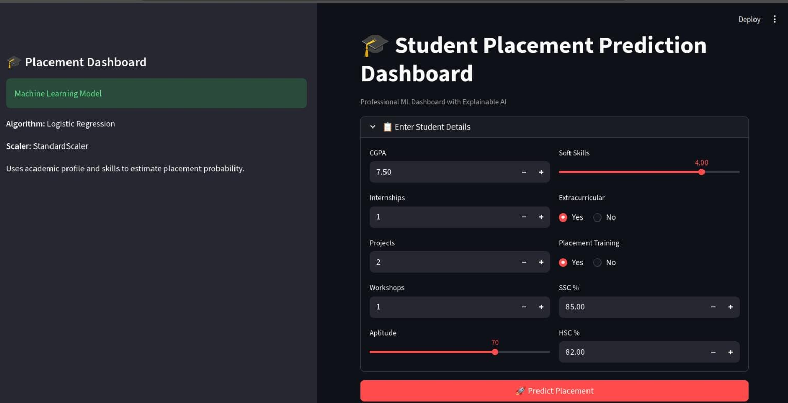
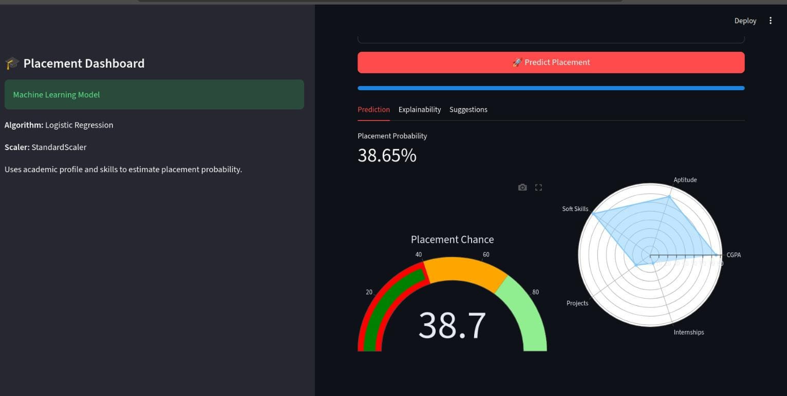
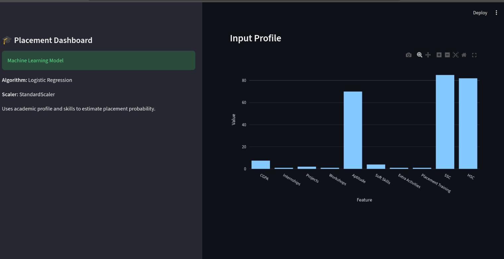
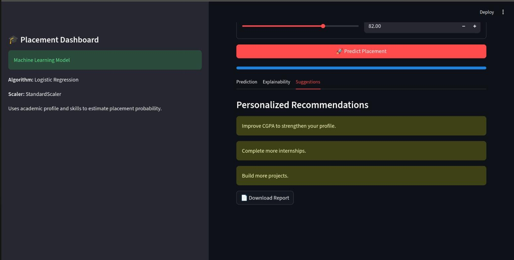

# Student Placement Prediction System

> An end-to-end Machine Learning application that predicts student placement outcomes using academic performance, internships, projects, certifications, aptitude scores and soft skills.


## Project Overview

Campus placement decisions depend on multiple academic, technical and extracurricular factors. Understanding how these factors influence placement can help students identify areas for improvement and enable institutions to provide targeted guidance.

This project develops an end-to-end machine learning pipeline that predicts placement outcomes using historical student data. The workflow includes data preprocessing, exploratory data analysis, feature engineering, model training, evaluation and deployment through an interactive Streamlit application.

## Live Demo

🚀 **Try the deployed application here:**

**🔗 Live Demo:** https://studentplacementprediction-system.streamlit.app/

The web application allows users to:

- Predict a student's placement status in real time.
- View the probability of placement.
- Enter academic, aptitude, internship, project, certification, and extracurricular details through an intuitive interface.
- Receive instant predictions powered by the trained machine learning model.


## Features

- Exploratory Data Analysis (EDA)
- Data preprocessing pipeline
- Feature scaling using StandardScaler
- Categorical encoding
- Stratified train-test split
- Multiple ML algorithms
- Hyperparameter tuning with GridSearchCV
- 5-fold Cross Validation
- ROC-AUC evaluation
- Feature Importance Analysis
- Interactive Streamlit Web Application


## Machine Learning Pipeline

Data Collection

↓

Data Cleaning

↓

Exploratory Data Analysis

↓

Feature Engineering

↓

Data Preprocessing

↓

Model Training

↓

Hyperparameter Optimization

↓

Model Evaluation

↓

Prediction


```text
Student_Placement_Prediction
│
├── data
│   ├── raw
│   └── processed
│
├── notebooks
│
├── images
│
├── models
│
├── app.py
│
├── requirements.txt
│
└── README.md
```

## Model Performance

| Model | Accuracy | ROC-AUC | Remarks |
|:------|:--------:|:-------:|:--------|
| **Logistic Regression** | **81%** | **0.884** | Best overall performance, achieving the highest classification accuracy and ROC-AUC with strong generalization. |
| Decision Tree | 72% | 0.714 | Simple and interpretable model, but prone to overfitting, resulting in lower predictive performance. |
| Random Forest | 79% | 0.867 | Ensemble model with improved robustness and competitive performance, though slightly below Logistic Regression. |

## Dashboard & Prediction

<p align="center">


</p>

## Analytics & Recommendations

<p align="center">


</p>

## Future Improvements

- Deep Learning models
- Automated feature engineering
- Real-time database integration
- Resume-based placement prediction


## Author

Mohammad Salman

B.Tech CSE
IIT (ISM) Dhanbad

LinkedIn :https://www.linkedin.com/in/salman-mohammad-192ba035b?

Email :salmanmohammad14113@gmail.com
